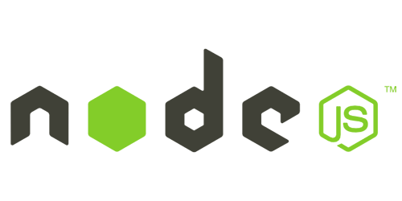

<div align="center" id="top"> 
  

&#xa0;

  <!-- <a href="https://nodeexpressknexshoppingcart.netlify.app">Demo</a> -->
</div>

<h1 align="center">Node Express Knex Shopping Cart</h1>

<p align="center">
  

  

  

  

  <!--  -->

  <!--  -->

  <!--  -->
</p>

<!-- Status -->

<!-- <h4 align="center">
	🚧  Node Express Knex Shopping Cart 🚀 Under construction...  🚧
</h4>

<hr> -->

<p align="center">
  <a href="#dart-about">About</a> &#xa0; | &#xa0; 
  <a href="#sparkles-features">Features</a> &#xa0; | &#xa0;
  <a href="#rocket-technologies">Technologies</a> &#xa0; | &#xa0;
  <a href="#white_check_mark-requirements">Requirements</a> &#xa0; | &#xa0;
  <a href="#checkered_flag-starting">Starting</a> &#xa0; | &#xa0;
  <a href="#memo-license">License</a> &#xa0; | &#xa0;
  <a href="https://github.com/manoj201" target="_blank">Author</a>
</p>

<br>

## :dart: About

Node JS API architecture with express js and Knex (postgress) Query builder.

## :sparkles: Features

:heavy_check_mark: well managed indutry architecture with fully ES6 fatures and babel transpile \
:heavy_check_mark: Knex postgress query builder \
:heavy_check_mark: Full authentic API using JWT authentication \
:heavy_check_mark: maintain different env files for different enviorenments \
:heavy_check_mark: Use nodeman for auto reload while developing \
:heavy_check_mark: Demostrate simple shopping cart API set \
:heavy_check_mark: Docker support : TODO \
:heavy_check_mark: AWS communication- Upload and read file to Amazon S3 \
:heavy_check_mark: Swagger API documentation

## :rocket: Technologies

The following tools were used in this project:

- [Node.js](https://nodejs.org/en/)
- [Express](https://expressjs.com/)
- [Knex](http://knexjs.org/)
- [ES6](http://es6-features.org/)
- [Babel](https://babeljs.io/)
- [Nodeman](https://nodemon.io/)
- [AWS-SDK](https://aws.amazon.com/sdk-for-node-js/)

## :white_check_mark: Requirements

Before starting :checkered_flag:, you need to have [Git](https://git-scm.com) , [Node](https://nodejs.org/en/) and [Knex](http://knexjs.org/) installed.

## :checkered_flag: Starting

```bash
# Clone this project
$ git clone https://github.com/manoj201/node-express-knex-shopping-cart

# Access
$ cd node-express-knex-shopping-cart

# Install dependencies
$ yarn

# Install knex query builder globally
$ yarn add knex -g

$ update knexfile.js and create respective DB on your local machine

# Run Migrations
$ knex migrate:latest

# For developers run the project
$ yarn watch:dev

# For rn production mode
$ yarn prod


# The server will initialize in the <http://localhost:3000>
```

## :chart: Swagger Document URL

This project API's well documented, sUse this link after project started <a href="http://localhost:3000/api-docs/v1/" target="_blank">Swagger UI</a>
&#xa0;

## :memo: License

This project is under license from MIT. For more details, see the [LICENSE](LICENSE.md) file.

Made with :heart: by <a href="https://github.com/manoj201" target="_blank">Manoj Gamachchige</a>

&#xa0;

<a href="#top">Back to top</a>
